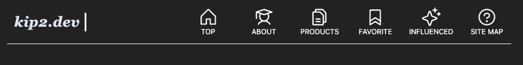
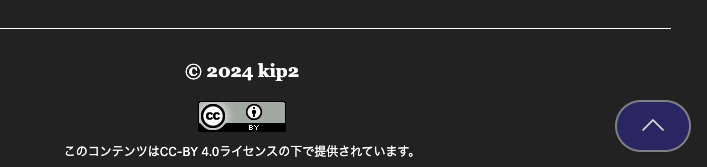

<h1 align="center">Recursionユーザー向けの解説</h1>

本プロジェクトはRecursionCSのバックエンドプロジェクト、Static Web Serversコースの最終課題である「Resume Website」を実装したサイトとなっています。

そのため、後学のユーザーに何かしら資するところがあればいいなと思い、サイト作成時において考えたこと等について解説を残しておきます。

なお、サーバーの立て方そのものはコースで説明しているため、主にサイトを構築する上での話に限って記載している点、あらかじめご了承ください。

---

## 目次

- [目次](#目次)
- [技術の選定について](#技術の選定について)
  - [ReactとTypeScriptを使用](#reactとtypescriptを使用)
    - [本音は？](#本音は)
  - [Tailwind CSSの採用](#tailwind-cssの採用)
- [レスポンシブの対応について](#レスポンシブの対応について)
  - [メニューのハンバーガー化](#メニューのハンバーガー化)
- [画面の一番上に戻るボタン](#画面の一番上に戻るボタン)
- [グリッドデザインの活用](#グリッドデザインの活用)
- [記事の作成について](#記事の作成について)
  - [markdownに独自の記法を追加](#markdownに独自の記法を追加)
  - [markdownから生成される記事のデザインについて](#markdownから生成される記事のデザインについて)
  - [記事増やすためのシェルスクリプトを作成](#記事増やすためのシェルスクリプトを作成)
    - [JSONにデータを更新するにあたってのツール](#jsonにデータを更新するにあたってのツール)
- [余白について(CSS)](#余白についてcss)
- [デプロイ作業の自動化](#デプロイ作業の自動化)
  - [追記(2024/05/26)](#追記20240526)
- [Dockerの使用](#dockerの使用)


---

## 技術の選定について

### ReactとTypeScriptを使用

使用技術としていくつか候補がある中で、ReactとTypeScriptを採用しています。

Reactではコンポーネント単位で開発できるため、関心の分離を行った上で開発が可能であるからです。

また、TypeScriptについては、型の補助を利用できるため予期せぬエラーを極力減らすことができます。

#### 本音は？

以上が建前です。
単純にReactとTypeScriptが好きだから使っています。

Reactの利点は建前の解説と同じです。

TypeScriptについては、vscodeの拡張によってコンパイラ(トランスパイラ？)による補助が使えるため、コードを変更した時に直すべき箇所や誤りに気づきやすく、拡張がやりやすいからです。

コンパイラと協力して作るというのはとても楽しい体験なので、それが使いたかっただけとも言える。

他の言語やライブラリでも似たような機能が使えるようであればぜひ教えてください。
コンピュータに関しては雑食性の生物なので飛びつきます。
よろしくお願いします。

### Tailwind CSSの採用

cssのフレームワークとして、Tailwind CSSを採用しています。

利点として以下が挙げられます。
- Recursionユーザーとしてはお馴染みの、Bootstrapと同じように、html上でcssデザインが可能である。
- メディアクエリにも対応している。
- 足りないものがあれば独自に拡張が可能。
- cssファイルを用意する必要がないくらい、柔軟性がある。
- css設計をあまり気にしないで良い。

Tailwind CSSを使用したことで、今回はcssファイルを特別に用意してまで記載したのはあるコンポーネントに紐づく1ファイルのみであり、他は全てtsx上に直に記載しています。

---

## レスポンシブの対応について

現代はスマートフォンが普及しており、サイト作成において、レスポンシブな形に対応しておく必要があります。

Tailwind CSSによるメディアクエリ機能を利用しており、作成にあたってはcss全体の面倒を見る必要がない形で作成しています(これにより、css設計を"あまり"気にしなくて良い)。

Tailwind CSSいいよTailwind CSS。
みんな使ってみよう。

### メニューのハンバーガー化

当サイトはPCサイズの表示においては、サイトのメニューボタンをHeaderに全て横並びで配置しており、ボタンを押すことで各ページにアクセスできるようになっています。



しかし、スマホの画面サイズでは表示領域が小さいため、ハンバーガーメニューにまとめることで対応しました。


ハンバーガーメニューをクリックすると、アコーディオンメニューが表示されるようになっており、そこから各ページにアクセスできるようにしました。


---
## 画面の一番上に戻るボタン

作成したサイトは、文字サイズがある程度の大きさであり、また、各ページのテキスト量も多いため、サイトが縦に長くなりがちな構成となっています。
また、各ページにアクセスするためのボタンがヘッダーにまとまっている構造上、ヘッダーのボタンを容易に押せるようにする必要がありました。

そのため、画面の一番上に戻るボタンを設置しています。

右端のボタンが該当のボタンとなっています。



---

## グリッドデザインの活用

サイトのデザインをカードデザインにすることに決定したことにより、グリッドデザインを取り入れています。

こちらはRecursionでの解説コースは現時点でないため、自前で学習しています。
その際は以下の書籍が参考になりました。

[作って学ぶ　HTML + CSS グリッドレイアウト | エビスコム - EBISUCOM](https://ebisu.com/grid-layout/)

cssデザインの歴史から紐解いて、flexデザインがどのように生まれたか、gridデザインがなぜ登場したか、と言ったところから説きおこしており、非常にオススメの書籍となっています。

---

## 記事の作成について

記事を作成するにはhtmlファイルを生成する必要があります。
しかし、文章をhtmlファイルに直して、毎回記載するのは非常に手間となります。
htmlのタグで文の構造を作り、また、そのタグ内に文章を記載しないといけないので、文章を作成することに集中できません。

あるいは、文章を別に作成した上でhtmlファイルに直すという手もありますが、こちらも手間となります。

そのため、markdownで記載したファイル(.md)を用意すれば、自動で記事に変換されるようにしました。

なお、どれだけ楽になるかは実例を挙げておくのでご覧ください。


htmlバージョン
```html
<h1>サンプル記事タイトル</h1>
<p>これはサンプル記事の本文です。この記事では、サンプルとしていくつかの日本語の文章を示します。CSSを使ってスタイルを適用し、名前空間的接頭辞を使用して、異なるモジュールを区別しています。</p>
<h2>セクション1：概要</h2>
<p>このセクションでは、記事の概要について説明します。名前空間的接頭辞を使うことで、クラス名が持つ役割や所属するカテゴリを明確にできます。</p>
<h3>サブセクション1.1：背景</h3>
<p>背景情報として、CSSの管理が大規模になると、クラス名の競合やスタイルの一貫性が問題になります。これを解決するために、名前空間的接頭辞を使用する手法が有効です。</p>
<h2>セクション2：実装例</h2>
<p>ここでは、具体的な実装例を示します。以下のコードは、名前空間的接頭辞を使用したCSSクラスの例です。</p>
<pre><code class="language-css">/* レイアウトモジュール */
.l-header {
    background-color: #f8f8f8;
    padding: 20px;
}

/* コンポーネントモジュール */
.m-navigation {
    display: flex;
    list-style: none;
    padding: 0;
}

.m-navigation li {
    margin-right: 10px;
}

/* 状態モジュール */
.is-active {
    font-weight: bold;
    color: #007BFF;
}
</code></pre>
<p>上記のコードでは、<code>.l-header</code>、<code>.m-navigation</code>、<code>.is-active</code>といったクラス名に名前空間的接頭辞を使用しています。</p>
<h2>セクション3：結論</h2>
<p>名前空間的接頭辞を使うことで、CSSの管理がより容易になり、スタイルの競合を避けることができます。この手法は、大規模なプロジェクトやチーム開発において特に有効です。</p>
<pre><code>
このMarkdown形式のサンプル記事は、HTML版と同じ内容を含んでおり、Markdownファイルとして保存して使用することができます。
</code></pre>
```

markdownバージョン
````markdown
# サンプル記事タイトル

これはサンプル記事の本文です。この記事では、サンプルとしていくつかの日本語の文章を示します。CSSを使ってスタイルを適用し、名前空間的接頭辞を使用して、異なるモジュールを区別しています。

## セクション1：概要

このセクションでは、記事の概要について説明します。名前空間的接頭辞を使うことで、クラス名が持つ役割や所属するカテゴリを明確にできます。

### サブセクション1.1：背景

背景情報として、CSSの管理が大規模になると、クラス名の競合やスタイルの一貫性が問題になります。これを解決するために、名前空間的接頭辞を使用する手法が有効です。

## セクション2：実装例

ここでは、具体的な実装例を示します。以下のコードは、名前空間的接頭辞を使用したCSSクラスの例です。

```css
/* レイアウトモジュール */
.l-header {
    background-color: #f8f8f8;
    padding: 20px;
}

/* コンポーネントモジュール */
.m-navigation {
    display: flex;
    list-style: none;
    padding: 0;
}

.m-navigation li {
    margin-right: 10px;
}

/* 状態モジュール */
.is-active {
    font-weight: bold;
    color: #007BFF;
}
```

上記のコードでは、`.l-header`、`.m-navigation`、`.is-active`といったクラス名に名前空間的接頭辞を使用しています。

## セクション3：結論

名前空間的接頭辞を使うことで、CSSの管理がより容易になり、スタイルの競合を避けることができます。この手法は、大規模なプロジェクトやチーム開発において特に有効です。

````

### markdownに独自の記法を追加

markdownの変換においては、githubのmarkdownの形式に対応しています。

[基本的な書き方とフォーマットの構文 - GitHub Docs](https://docs.github.com/ja/get-started/writing-on-github/getting-started-with-writing-and-formatting-on-github/basic-writing-and-formatting-syntax)

しかし、githubのmarkdown形式では、空行を間に挟むような書き方ができません(あるいは自分が知らないだけかも。知っている人いたら教えて)。

そのため、Reactのコンポーネントを用意し、独自の記法をした場合にそれらが挿入されるように対応しています。

拡張した構文は以下になります。

- youtubeのリンクを貼ると、プレイヤー埋め込みのコンポーネントに変換する。
- ブランク行を追加するための記法を、ブランクの間隔の差の違いで2種類用意しています。

実例を挙げます。

```markdown
広い空白を挟む書き方
:::Blank

狭い空白を挟む書き方
:::LittleBlank

youtubeリンクはそのまま貼ったらOK(アドレスはダミーです)
https://www.youtube.com/watch?v=KKKKKKKKKKK
```

なお、これらの独自記法は拡張で増やすことも可能となっています。
この辺りに興味のある方は、[こちら](https://github.com/kip2/my-website/blob/main/src/Components/Functions/MarkdownViewer/MarkdownViewer.tsx)のソースコードを読んでみてください。

### markdownから生成される記事のデザインについて

markdownから生成される記事のデザインについては、別にcssを作成し、それを適用することで統一したデザインになるようにしています。

### 記事増やすためのシェルスクリプトを作成

記事ファイルはJSONで管理しており、記事を増やすために以下のめんどくさい作業が必要になります。
- 記事そのもののmdファイルを作成する。
- 様式に従ったJSONの記載を増やす。
- また、JSONにはmdファイルのアドレスを記載する必要がある。

これらを簡単な受け答えをするだけで一括で作成されるよう、シェルスクリプトで対応しました。
zshで作成しているので、zshで実行する必要があることに注意してください。

```shell
# rootパスから以下を実行する
cd ./public/pages
zsh page_generator.sh

# あるいは
cd ./public/pages
. page_generator.sh
```

なお、これは追加のみで削除は対応していません。
削除はやることが複雑＆間単な操作で削除できると誤って削除してしまう可能性がある、といった2点から、あえて実装していません。

#### JSONにデータを更新するにあたってのツール

JSONにデータを追加するにあたっては、色々手段があると思います。

今回のプロダクトにおいては、開発環境と本番環境で環境が違っており、移植性の高いコードが望ましかったため、スクリプト系の言語にしようと決めました。
(コンパイル系の言語を使うと、開発環境に移した段階で、コンパイルの実行と、自己実行形式のファイルを特定のディレクトリに移動する必要があるため)

その上で、最初はpythonが候補に挙がったのですが、JSONを扱う際の文字コードの問題があり、最終的にシェルスクリプトで行うことに決めました。

シェルスクリプトだけでJSONの操作を行うのは難しいので、jqを使用しています。

jqはJSONを気軽に扱えるので、とてもおすすめです。

インストール等は公式ページを参照してください。

[jq公式サイト](https://jqlang.github.io/jq/)

---

## 余白について(CSS)

CSSでは余白に悩むことがよくあります。

セクションなどのある要素に対してマージンをつけると、その要素にマージンが依存するので、調整や変更をする際大変です。

個別の細かい調整においてはセクションにつけた方がいいのですが、単純に空白を挟みたい場合は、コンポーネント化しておくと簡単に調整が効きます。

今回はBlankとLittleBlankコンポーネントとして、独立して用意することで、簡単に余白を追加できるようにしています。

Blankコンポーネント
```tsx
const Blank = () => {
    return (
        <>
            <span className="block h-12 box-inherit"/>
        </>
    )
}

export default Blank
```

LittleBlankコンポーネント
```tsx
const LittleBlank = () => {
    return (
        <>
            <span className="block h-6 box-inherit"/>
        </>
    )
}

export default LittleBlank
```

---

## デプロイ作業の自動化

デプロイ作業を自動化するためのスクリプトを組んでいます。
これにより、作業手順が以下のように簡略化されます。

まずソースコードを編集し、gitへpushを行います。

それから、本番環境にアクセスし、siteページにディレクトリを移動した後で以下のコマンドを実行します。

```shell
# 本番環境の、サイトのソースコードのルートパスで行う
bash deploy.sh

# もしくは
. deploy.sh
```

こちらは汎用性を考えてbashで作成しています(他に流用ができるので)。

### 追記(2024/05/26)

後日、本番環境でのビルド時にエラーが発生してビルドができないことがありました。

原因を色々調査したところ、どうやらDocker関係のファイル(キャッシュとかだと思う)が、本番環境の容量を圧迫していた模様。

それに対処するため、本番環境のストレージ容量が一定のGBになった際に、自動でDockerのキャッシュをクリアするコマンドを追加しました。

---

## Dockerの使用

なお、要件にはないDockerを使用しています。
これにより、静的ファイルのビルドにおいて、環境ごとの差異を気にする必要がなくなります。

今回はDBもない静的なサイトなので、そこまで活躍の幅はありませんでしたが、今後はコンテナ技術も活かしていきたいです。
今回のはそのための布石であり、実験でもあります。

